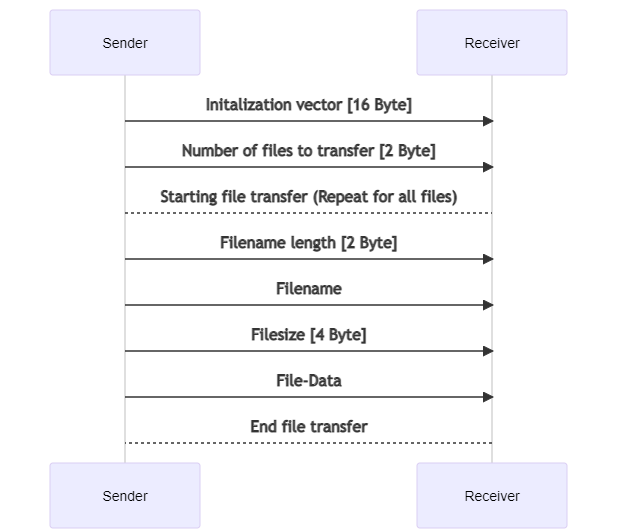

# local_file_transfer

This project allows users to transfer multiple files across devices in a local network. It uses a 128-bit pre-shared key for AES-CBC encryption. (Sequence diagram created with [mermaid](https://github.com/mermaid-js/mermaid))




<!-- Sequende Diagram Code (add one hypen to ->, had to be removed, otherwise it would be seen as end of the comment)
Sender ->> Receiver: Initalization vector [16 Byte]
Sender ->> Receiver: Number of files to transfer [2 Byte]
Sender -> Receiver: Starting file transfer (Repeat for all files)
Sender ->> Receiver: Filename length [2 Byte]
Sender ->> Receiver: Filename
Sender ->> Receiver: Filesize [4 Byte]
Sender ->> Receiver: File-Data
Receiver -> Sender: End file transfer
-->

## Versions

Tested with:

* Python 3.9.5
* pycryptodome 3.10.1
* Ubuntu 20.04.2 and Windows 10

## Requirements

* pycryptodome: pip install pycryptodome


## Usage

#### Receiver

The receiver is waiting for incoming connections. The receiver script must be started first. The received files are stored in a directory called "received_files" located in the current directory.
```
$ file_transfer_receive.py [-p PORT] [-k KEY]

optional arguments:
  -p, --port PORT                  Port on which the receiver is listening. Default: 6000
  -k, --key KEY                    Set a new key. Provide 16 characters (no backslash) as the string will be utf-8 encoded. Default key provided in the script.

```

#### Sender

The sender has to provide the IP-address or the hostname of the receiver.
The sender is able to select multiple files via the tkinter.filedialog interface.

```
$ file_transfer_send.py [-n HOSTNAME] [-a ADDRESS] [-p PORT] [-k KEY]

optional arguments:
  -n, --name HOSTNAME              Hostname of receiver
  -a, --address ADDRESS            IP-Address of receiver
  -p, --port PORT                  Port on which the receiver is listening. Default: 6000
  -k, --key KEY                    Set a new key. Provide 16 characters (no backslash) as the string will be utf-8 encoded. Default key provided in the script.
```
